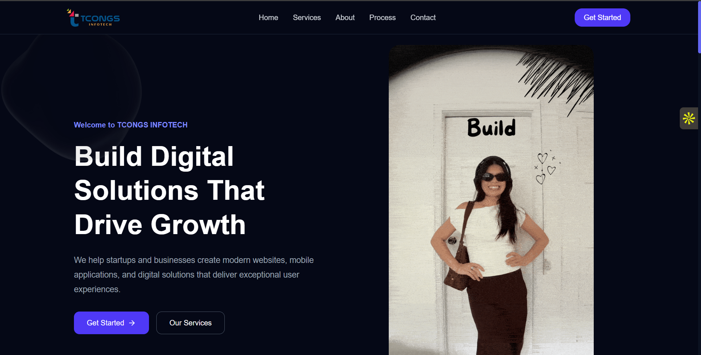
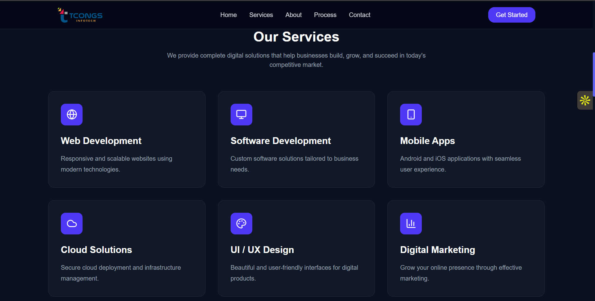
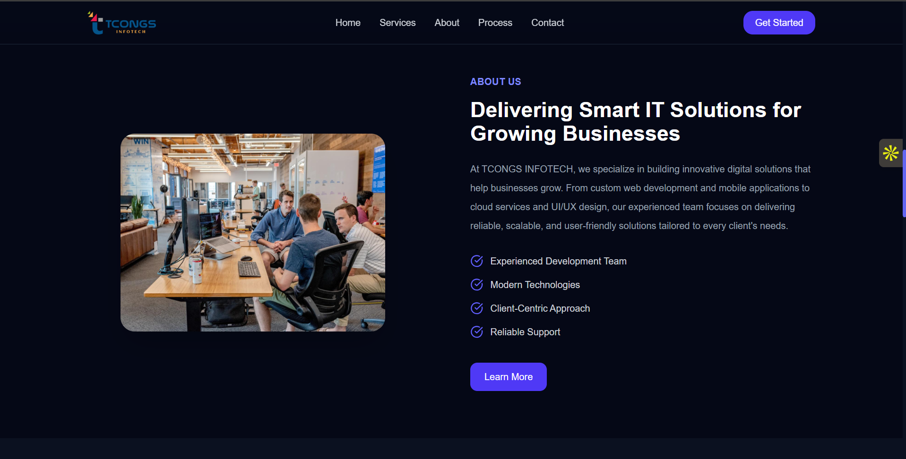

# TCONGS INFOTECH - Homepage Redesign

A modern, responsive homepage redesign built as part of the **TCONGS INFOTECH Frontend Internship Assignment**.

## 🚀 Live Demo

https://tcong-task.vercel.app

---

## 📸 Preview

### Hero Section



### Services



### About



### Footer


---

## ✨ Features

- Modern and responsive homepage
- Clean UI/UX
- Component-based React architecture
- Smooth animations with Framer Motion
- Mobile-first responsive design
- Reusable components
- Optimized layout

---

## 🛠️ Tech Stack

- React.js
- Vite
- Tailwind CSS
- Framer Motion
- Lucide React
- React Icons

---

## 📂 Folder Structure

```text
src
│
├── assets
├── components
│   ├── Navbar.jsx
│   ├── Hero.jsx
│   ├── Services.jsx
│   ├── About.jsx
│   ├── WhyChoose.jsx
│   ├── Process.jsx
│   ├── Testimonials.jsx
│   ├── CTA.jsx
│   └── Footer.jsx
│
├── App.jsx
├── main.jsx
└── index.css
```

## ⚙️ Installation

```bash
git clone https://github.com/chaitanyaB12/tcong_Task.git

cd tcong_Task

npm install

npm run dev
```

## 📦 Production Build

```bash
npm run build
```

## 👨‍💻 Author

**Chaitanya**

- Portfolio: https://chaitanyab.vercel.app/
- GitHub: https://github.com/chaitanyaB12